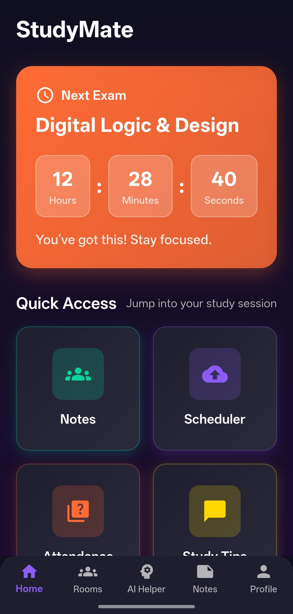
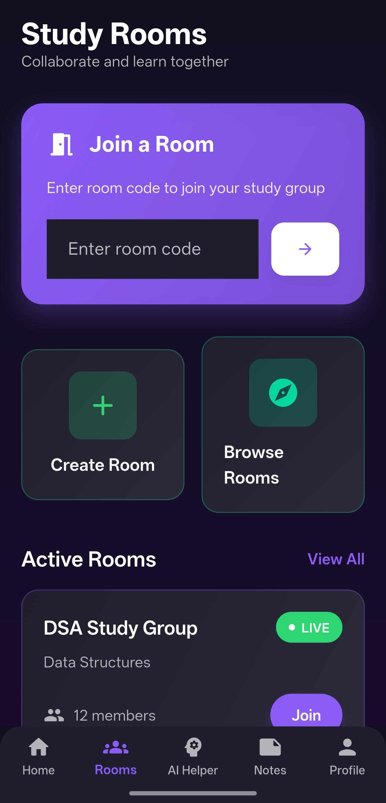
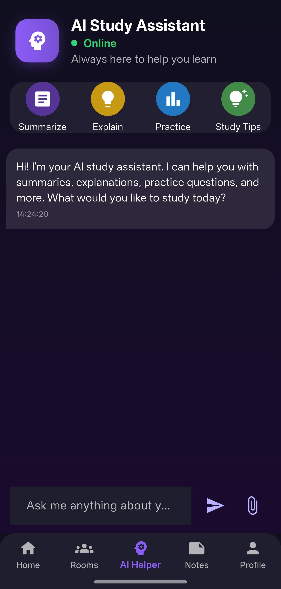
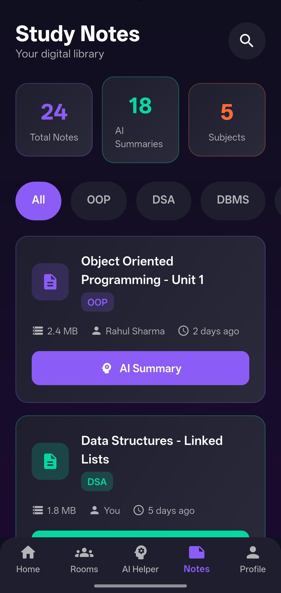
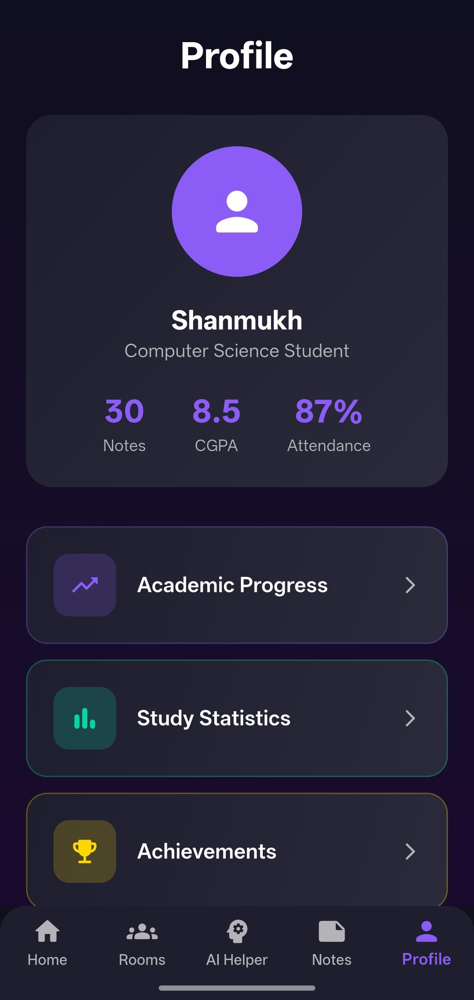

<div align="center">
  <h1>🎓 StudyMate</h1>
  <p><strong>Your Ultimate AI-Powered Academic Companion</strong></p>
  <p>
    
    
    
  </p>
</div>

<br/>

StudyMate is a comprehensive, feature-rich Flutter application designed to revolutionize the way students manage their academics, collaborate with peers, and leverage Artificial Intelligence for enhanced learning. With a modern, glassmorphic user interface, StudyMate brings all your study tools into one intuitive platform.

---

## ✨ Key Features

### 🤖 AI Study Assistant
Interact with a smart AI assistant to accelerate your learning. Ask questions, generate text summaries, get simple explanations for complex topics, and request practice questions or study tips on the fly.

### 👥 Collaborative Study Rooms
Join or create interactive study groups. Collaborate with classmates in real-time using built-in seamless audio/video communication powered by **Zego Express Engine**.

### 📚 Digital Study Notes
Your personal library in your pocket. Upload, organize by subjects (OOP, DSA, DBMS, etc.), and access your notes anytime. Instantly generate **AI Summaries** for your PDFs and documents for quick revisions. 

### 📅 Smart Scheduler & Tracker
Stay on top of your deadlines. Manage your timetable with an interactive calendar, track your daily attendance, calculate your CGPA automatically, and keep an eye on upcoming exams with the custom countdown timer.

### 👤 Insightful Profile Analytics
Monitor your academic performance at a glance. View your overall statistics including total notes, current CGPA, attendance percentage, and unlock achievements as you progress.

---

## 📸 App Screenshots


| Home Dashboard | Study Rooms |
| :---: | :---: |
|  |  |

| AI Study Assistant | Study Notes Library |
| :---: | :---: |
|  |  |

| Profile & Analytics |
| :---: |
|  |

---

## 🛠️ Tech Stack & Dependencies

- **Frontend:** [Flutter](https://flutter.dev/) (Dart)
- **Backend & Auth:** [Supabase](https://supabase.com/)
- **Real-time Communication:** [Zego Express Engine](https://www.zegocloud.com/)
- **UI / Aesthetics:** `glassmorphism`, `cupertino_icons`
- **Utilities:** 
  - `table_calendar` (Scheduling)
  - `syncfusion_flutter_pdf` & `file_picker` (Notes & Document management)
  - `encrypt` (Data security)
  - `permission_handler` (Device permissions)

---

## 🚀 Getting Started

### Prerequisites
- Flutter SDK (`>=3.2.6 <4.0.0`)
- Android Studio / VS Code
- A [Supabase](https://supabase.com/) project (for backend services)
- A [ZegoCloud](https://www.zegocloud.com/) account (for study rooms)

### Installation

1. **Clone the repository:**
   ```bash
   git clone https://github.com/your-username/study_mate_app.git
   cd study_mate_app
   ```

2. **Install dependencies:**
   ```bash
   flutter pub get
   ```

3. **Configure Environment Variables:**
   - Set up your Supabase URL and Anon Key.
   - Set up your ZegoCloud App ID and App Sign.
   - *(Add these to your configuration files as required by the app's internal setup).*

4. **Run the App:**
   ```bash
   flutter run
   ```

---

## 📂 Project Structure

```text
lib/
├── auth/            # Authentication logic and screens
├── screens/         # Main application screens (Home, Notes, Profile, etc.)
├── theme/           # App-wide theme, colors, and styling (Glassmorphism configs)
├── widgets/         # Reusable UI components
├── Quick Access/    # Quick tools (Attendance, CGPA calculator, Scheduler, Study tips)
└── main.dart        # Application entry point
```

---

<div align="center">
  <p>Built with ❤️ for students, by students.</p>
</div>
